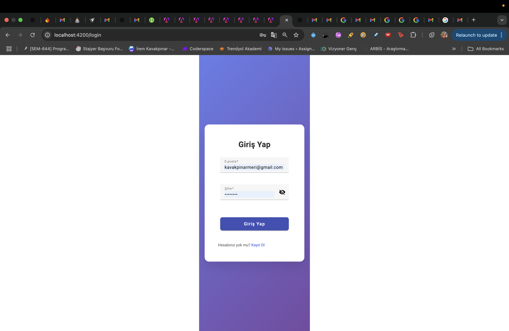
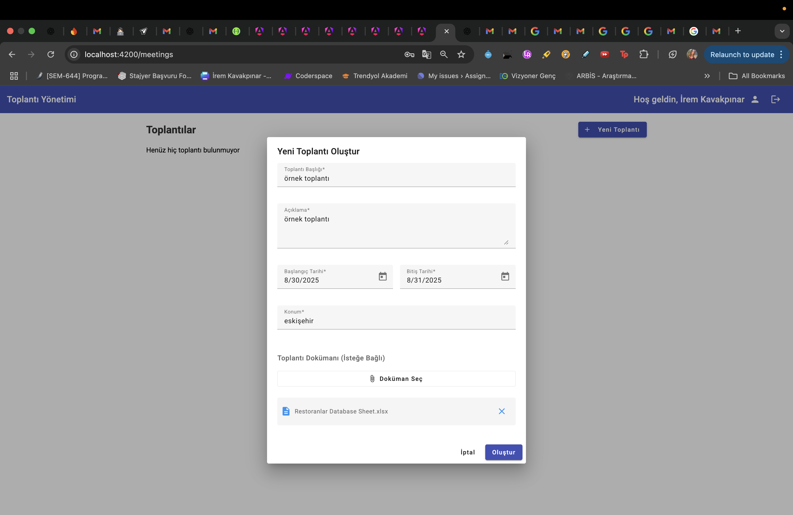
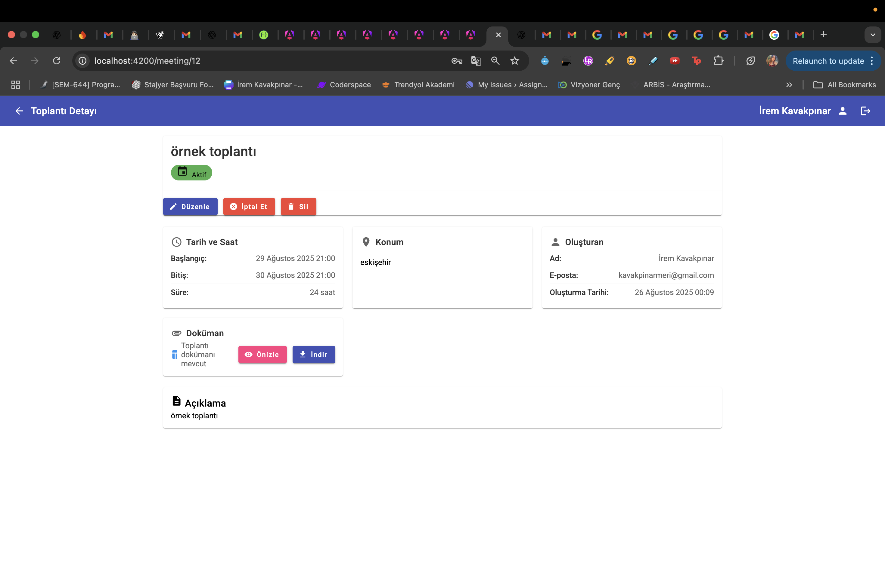
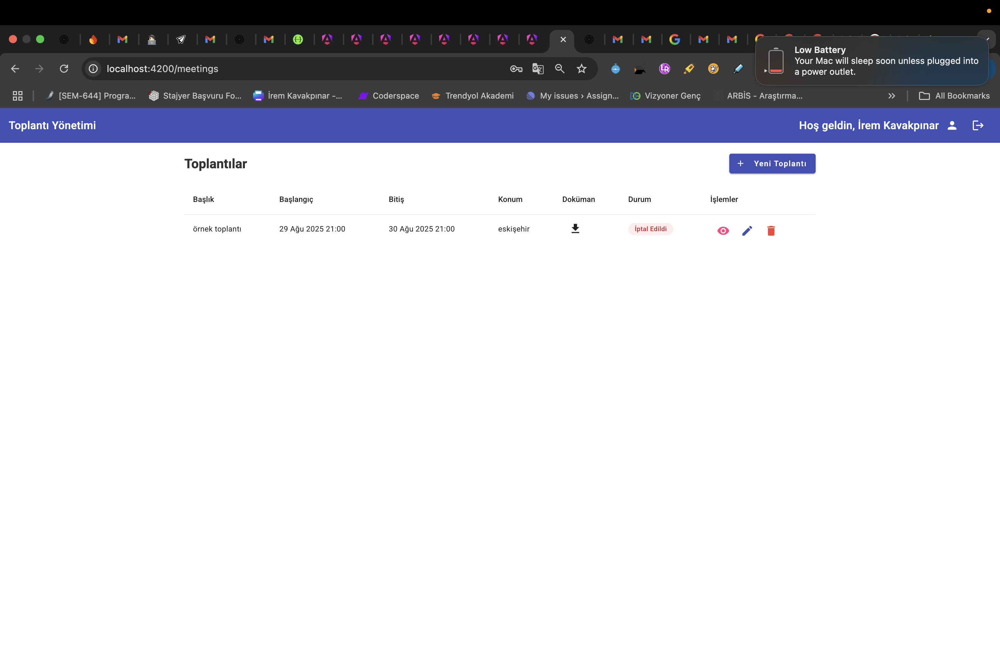
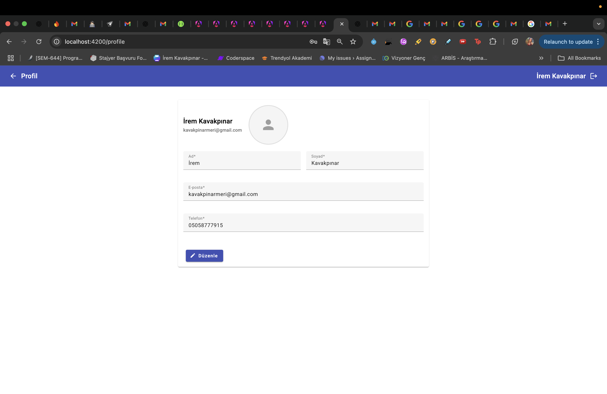

# Meeting Management System

## 📋 Proje Hakkında

Bu proje, toplantı yönetimi için geliştirilmiş modern bir web uygulamasıdır. .NET Core Web API backend ve Angular frontend teknolojileri kullanılarak geliştirilmiştir.

## 📸 Ekran Görüntüleri

### Meeting Management


### Kullanıcı Kayıt Sayfası

*Kullanıcılar ad, soyad, e-posta, telefon ve şifre bilgileriyle kayıt olabilir. Profil resmi yükleme özelliği mevcuttur.*

### Giriş Sayfası

*E-posta ve şifre ile güvenli giriş yapılabilir. "Hesabınız yok mu? Kayıt Ol" linki ile kayıt sayfasına yönlendirme.*

### Toplantı Oluşturma

*Yeni toplantı oluşturma formu. Başlık, açıklama, başlangıç/bitiş tarihleri, konum ve dosya ekleme özellikleri.*

### Toplantılar Sayfası

*Tüm toplantıların listelendiği ana sayfa. Başlık, tarih, konum, durum ve işlem butonları görüntülenir.*

### Toplantı Detay Sayfası

*Toplantı detay sayfası. Tarih/saat, konum, oluşturan kişi bilgileri, açıklama ve eklenen dokümanlar görüntülenir.*

### Toplantı İptal Etme

*Toplantı listesinde "İptal Et" butonu ile toplantılar iptal edilebilir. İptal edilen toplantılar kırmızı renkte "İptal Edildi" durumu ile gösterilir.*

### Kullanıcı Profil Sayfası

*Kullanıcı profil sayfası. Ad, soyad, e-posta ve telefon bilgileri görüntülenir ve güncellenebilir. Profil resmi de değiştirilebilir.*

## 🚀 Özellikler

### ✅ Çalışan Özellikler

#### 🔐 Kimlik Doğrulama ve Yetkilendirme
- Kullanıcı kayıt ve giriş sistemi
- JWT token tabanlı kimlik doğrulama
- Güvenli şifre hashleme
- Kayıt sonrası hoş geldiniz e-postası gönderimi

#### 📅 Toplantı Yönetimi
- Yeni toplantı oluşturma
- Toplantı listesi görüntüleme
- Toplantı detayları görüntüleme
- Toplantı düzenleme ve silme
- Toplantı oluşturulduğunda otomatik bilgilendirme e-postası

#### 📁 Dosya Yönetimi
- Toplantılara dosya ekleme
- Dosya yükleme ve indirme
- Güvenli dosya depolama (wwwroot klasörü)

#### 📧 E-posta Sistemi
- Gmail SMTP entegrasyonu
- Hoş geldiniz e-postaları
- Toplantı bilgilendirme e-postaları
- E-posta yapılandırma test endpoint'i

#### 👤 Kullanıcı Profili
- Profil bilgilerini görüntüleme
- Profil bilgilerini güncelleme

#### 🔄 Arka Plan İşleri
- Hangfire entegrasyonu
- Arka plan görevleri yönetimi
- İş kuyruğu dashboard'u

#### 📊 Veritabanı
- Entity Framework Core
- SQL Server veritabanı
- Migration desteği
- Audit log sistemi (silinen kayıtlar için)

## 🛠️ Teknoloji Stack

### Backend (.NET Core 8)
- **Framework:** ASP.NET Core Web API
- **Veritabanı:** Entity Framework Core + SQL Server
- **Kimlik Doğrulama:** JWT Bearer Token
- **E-posta:** Gmail SMTP
- **Arka Plan İşleri:** Hangfire
- **Dosya Depolama:** wwwroot klasörü

### Frontend (Angular 18)
- **Framework:** Angular 18
- **UI Kütüphanesi:** Angular Material
- **HTTP Client:** Angular HttpClient
- **Routing:** Angular Router
- **Form Yönetimi:** Reactive Forms

## 📦 Kurulum

### Gereksinimler
- .NET 8 SDK
- Node.js (v18+)
- SQL Server
- Angular CLI

### Backend Kurulumu

1. Proje klasörüne gidin:
```bash
cd MeetingManagement.API
```

2. NuGet paketlerini yükleyin:
```bash
dotnet restore
```

3. Veritabanı bağlantı stringini `appsettings.json` dosyasında güncelleyin

4. E-posta ayarlarını `appsettings.Development.json` dosyasında yapılandırın:
```json
{
  "EmailSettings": {
    "SmtpServer": "smtp.gmail.com",
    "SmtpPort": "587",
    "SmtpUsername": "your-email@gmail.com",
    "SmtpPassword": "your-app-password",
    "FromEmail": "your-email@gmail.com"
  }
}
```

5. Veritabanı migration'larını çalıştırın:
```bash
dotnet ef database update
```

6. Uygulamayı başlatın:
```bash
dotnet run --launch-profile https
```

### Frontend Kurulumu

1. Frontend klasörüne gidin:
```bash
cd meeting-management-frontend
```

2. Bağımlılıkları yükleyin:
```bash
npm install
```

3. Uygulamayı başlatın:
```bash
npm start
```

## 🌐 Erişim URL'leri

- **Frontend:** http://localhost:4200
- **Backend API:** https://localhost:7002
- **Hangfire Dashboard:** https://localhost:7002/hangfire
- **Swagger UI:** https://localhost:7002/swagger

## 📋 API Endpoints

### Kimlik Doğrulama
- `POST /api/Auth/register` - Kullanıcı kaydı
- `POST /api/Auth/login` - Kullanıcı girişi
- `GET /api/Auth/test-email-config` - E-posta yapılandırma testi

### Toplantılar
- `GET /api/Meeting` - Tüm toplantıları listele
- `GET /api/Meeting/{id}` - Toplantı detayı
- `POST /api/Meeting` - Yeni toplantı oluştur
- `PUT /api/Meeting/{id}` - Toplantı güncelle
- `DELETE /api/Meeting/{id}` - Toplantı sil

### Dosya Yükleme
- `POST /api/FileUpload/upload` - Dosya yükle
- `GET /api/FileUpload/download/{fileName}` - Dosya indir

### Kullanıcı Profili
- `GET /api/User/profile` - Profil bilgilerini getir
- `PUT /api/User/profile` - Profil bilgilerini güncelle

## 🔧 Yapılandırma

### E-posta Ayarları
Gmail SMTP kullanmak için:
1. Gmail hesabınızda 2FA'yı etkinleştirin
2. Uygulama şifresi oluşturun
3. `appsettings.Development.json` dosyasında e-posta ayarlarını yapılandırın

### Veritabanı
SQL Server bağlantı stringi `appsettings.json` dosyasında yapılandırılır.

### E-posta Gönderimi
- **Sorun:** SMTP bağlantı hataları
- **Çözüm:** Gmail SMTP ayarları ve uygulama şifresi kullanımı

### Dosya Yükleme
- **Sorun:** Dosya yolları sorunu
- **Çözüm:** wwwroot klasörü kullanımı ile çözüldü

## 📝 Geliştirme Notları

- Tüm API endpoint'leri JWT token ile korunmaktadır
- E-posta servisi asenkron olarak çalışmaktadır
- Dosyalar güvenli bir şekilde wwwroot klasöründe saklanmaktadır
- Hangfire ile arka plan işleri yönetilmektedir
- Angular Material ile modern UI tasarımı sağlanmaktadır
